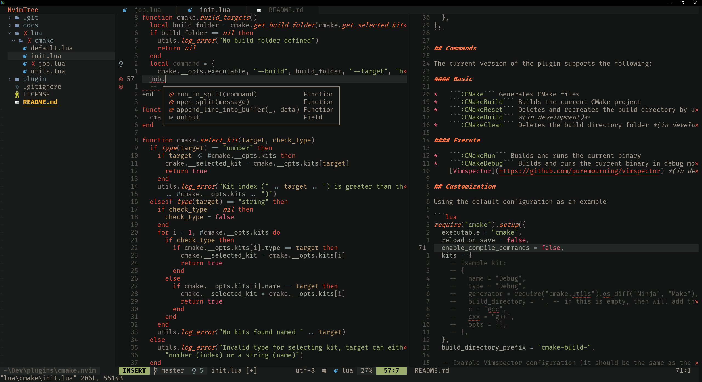

# Ignite.nvim

<p align="center">
  <h2 align="center">Ignite.nvim</h2>
</p>

<p align="center">
  
</p>

# Prerequisites

using [Vim Plug](https://github.com/junegunn/vim-plug)

```vim
Plug "Oniup/ignite.nvim"
```

Using [Packer](https://github.com/wbthomason/packer.nvim)

```lua
use {
  "Oniup/ignite.nvim",
  config = function()
    require("ignite").setup()
    vim.cmd([[
      syntax enable
      colorscheme ignite
    ]])
  end,
}
```

using [Lazy](https://github.com/folke/lazy.nvim)

```lua
return {
  "Oniup/ignite.nvim",
  lazy = false,
  priority = 1000,
  config = function()
    require("ignite").setup()
    vim.cmd([[
      syntax enable
      colorscheme ignite
    ]])
  end
}
```

# Configuration

***Coming Soon***

# Acknowledgements

* [Lush](https://github.com/rktjmp/lush.nvim) 
    * Used to design the color scheme
* [Gruvbox](https://github.com/ellisonleao/gruvbox.nvim)
    * Ignite is inspiration by gruvbox and their src helped me understand how to
      port from lush
